# MisterMath


Two numbers, one operation, and **you pick the design pattern that runs it**.
A learning project for **SOLID** and **design patterns** in Spring Boot.

---

## Contents

1. [Quick start](#1-quick-start)
2. [Architecture](#2-architecture)
3. [Request flow](#3-request-flow-post)
4. [Pattern selection](#4-pattern-selection)
5. [The five patterns](#5-the-five-patterns)
6. [SOLID map](#6-solid-map)
7. [Endpoints](#7-endpoints)
8. [Response wrapper and errors](#8-response-wrapper-and-errors)
9. [Security (JWT)](#9-security-jwt)
10. [Persistence: PostgreSQL + Redis](#10-persistence-postgresql--redis)
11. [Logging](#11-logging)
12. [Docker](#12-docker)
13. [CI/CD](#13-cicd)
14. [Tests](#14-tests)
15. [Project structure](#15-project-structure)

---

## 1. Quick start

```bash
docker compose up --build
```

```bash
# 1) token
TOKEN=$(curl -s -X POST localhost:8080/api/v1/auth/login \
  -H "Content-Type: application/json" \
  -d '{"username":"admin","password":"admin123"}' | jq -r .data.accessToken)

# 2) calculate
curl -s -X POST localhost:8080/api/v1/calculations \
  -H "Authorization: Bearer $TOKEN" -H "Content-Type: application/json" \
  -d '{"num1":10,"num2":5,"operation":"+","pattern":"STRATEGY"}'

# 3) recent transactions (Redis)
curl -s localhost:8080/api/v1/transactions -H "Authorization: Bearer $TOKEN"

# 4) one transaction (PostgreSQL)
curl -s localhost:8080/api/v1/transactions/1 -H "Authorization: Bearer $TOKEN"
```

More examples: [`requests.http`](requests.http).

---

## 2. Architecture

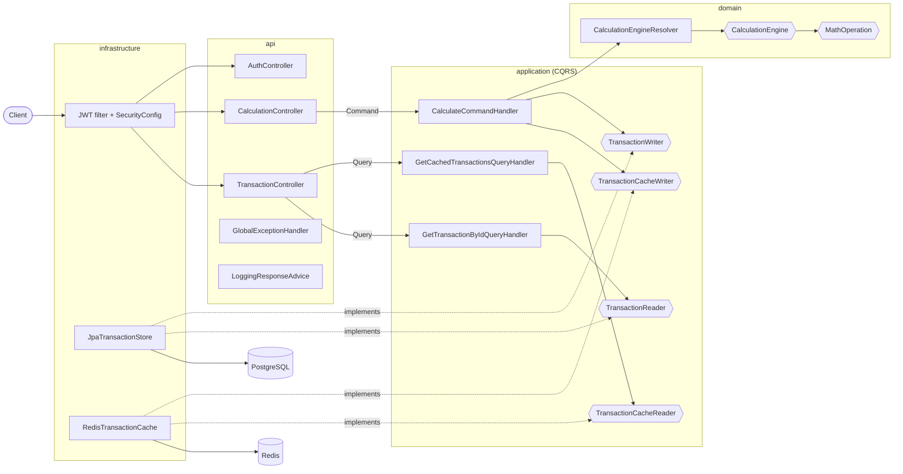

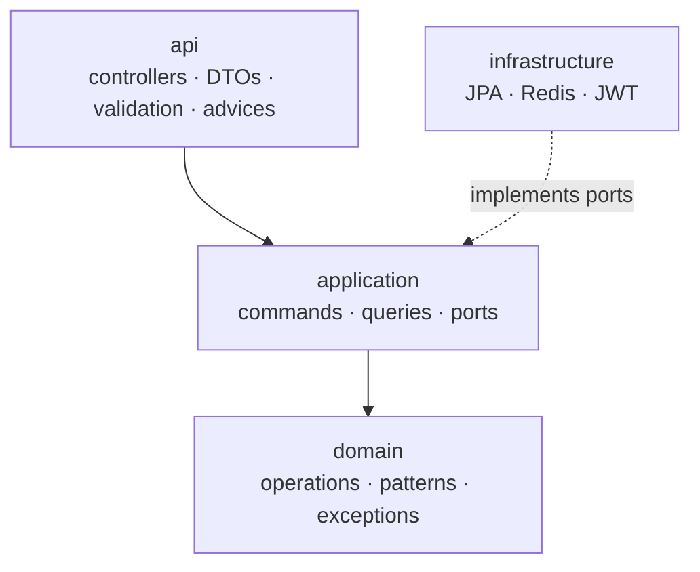

---

## 3. Request flow (POST)

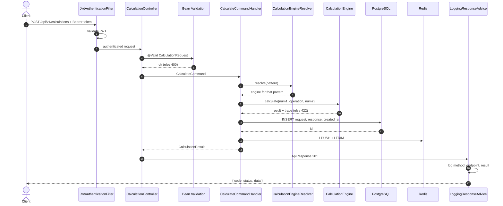

---

## 4. Pattern selection

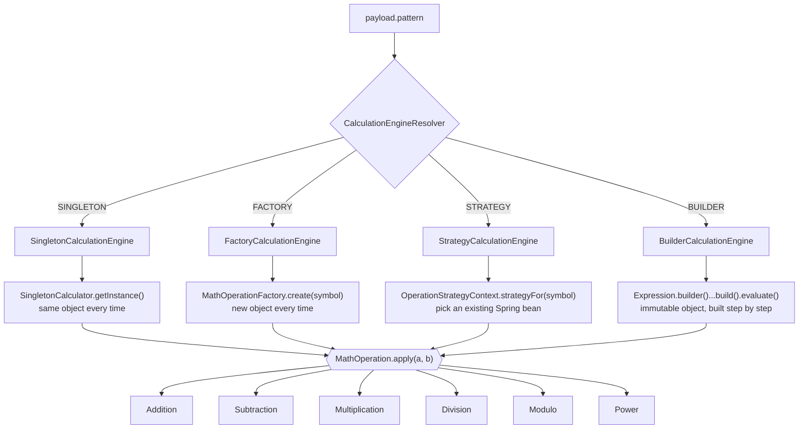

Same input, same result. Only the path changes, and the `trace` field in the response shows it:

| `pattern` | `data.engine` | `data.trace` (example for `10 + 5`) |
|---|---|---|
| `SINGLETON` | `SingletonCalculationEngine` | `SingletonCalculator.getInstance() returned the shared instance @1b2c3d` |
| `FACTORY` | `FactoryCalculationEngine` | `MathOperationFactory.create("+") built a new Addition instance` |
| `STRATEGY` | `StrategyCalculationEngine` | `OperationStrategyContext selected the Spring bean Addition for '+'` |
| `BUILDER` | `BuilderCalculationEngine` | `build() validated the parts and created the immutable expression [10 + 5]` |

---

## 5. The five patterns

### Singleton — `domain/pattern/singleton`

```mermaid
classDiagram
    class SingletonCalculator {
        -Map~OperationType, MathOperation~ operations
        -SingletonCalculator()
        +getInstance()$ SingletonCalculator
        +calculate(num1, symbol, num2) BigDecimal
    }
    class Holder {
        -INSTANCE$ SingletonCalculator
    }
    SingletonCalculator +-- Holder
    SingletonCalculationEngine ..> SingletonCalculator : getInstance()
```

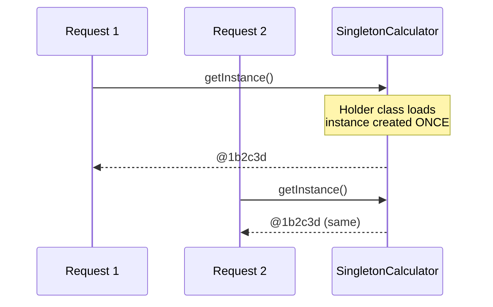

### Factory — `domain/pattern/factory`

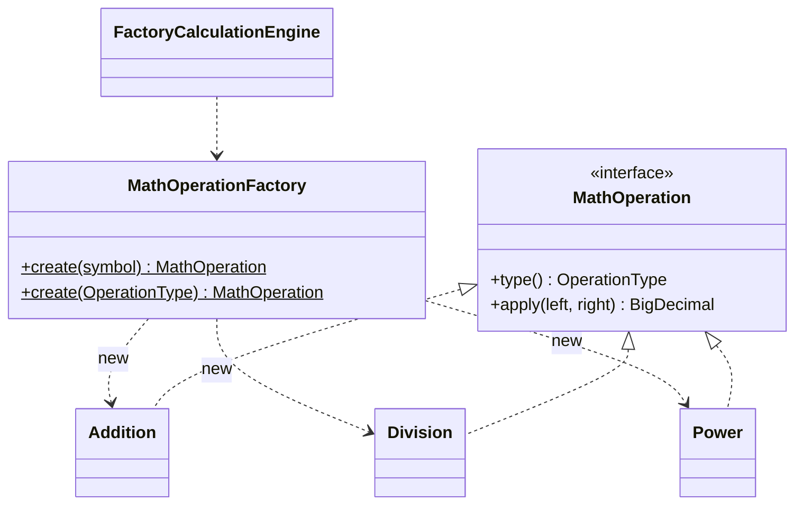

### Strategy — `domain/pattern/strategy`

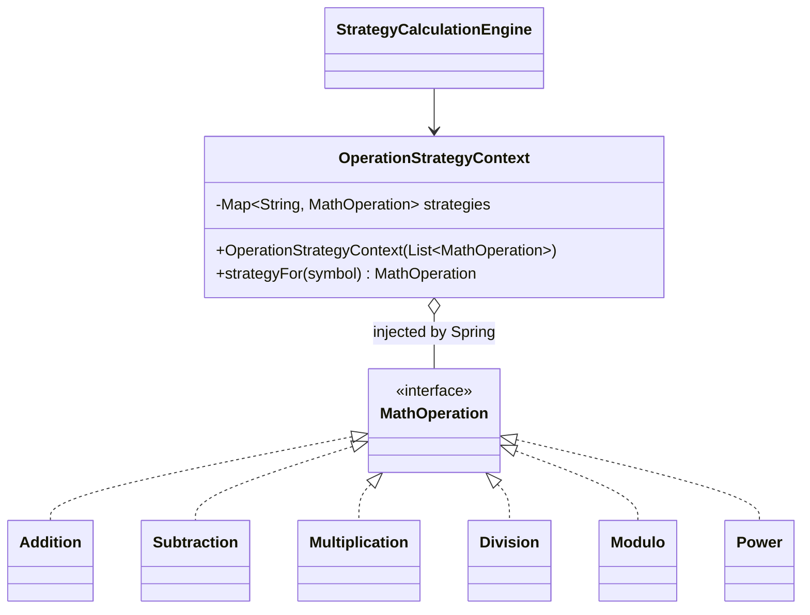

### Builder — `domain/pattern/builder`

```mermaid
classDiagram
    class Expression {
        -BigDecimal left
        -String operator
        -BigDecimal right
        -Expression(Builder)
        +builder()$ Builder
        +evaluate() BigDecimal
    }
    class Builder {
        +left(BigDecimal) Builder
        +operator(String) Builder
        +right(BigDecimal) Builder
        +build() Expression
    }
    Expression +-- Builder
    BuilderCalculationEngine ..> Builder
```

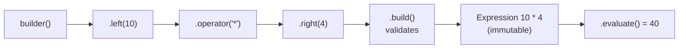

### CQRS — `application/cqrs`, `application/command`, `application/query`

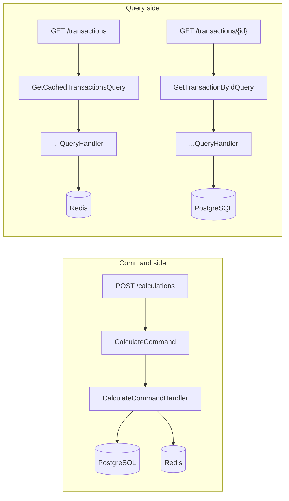

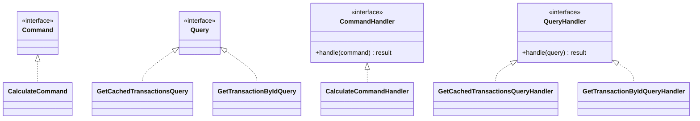

---

## 6. SOLID map

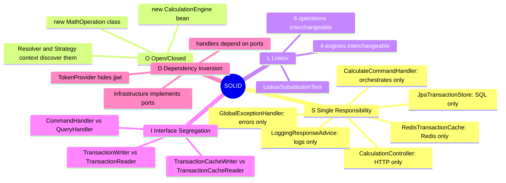

| Principle | Where | Image example → MisterMath |
|---|---|---|
| **S** | `CalculationController`, `CalculateCommandHandler`, `JpaTransactionStore`, `RedisTransactionCache`, `TransactionViewMapper` | `Invoice / InvoiceRepository / InvoicePrinter` → controller / handler / store / cache |
| **O** | `MathOperation`, `CalculationEngine`, `CalculationEngineResolver`, `OperationStrategyContext` | `Payment` + `CreditCardPayment`, `PaypalPayment` → `MathOperation` + `Addition`, `Division`... |
| **L** | every `MathOperation`, every `CalculationEngine` (`LiskovSubstitutionTest`) | `Bird bird = new Eagle()` → `CalculationEngine engine = new FactoryCalculationEngine()` |
| **I** | `CommandHandler` / `QueryHandler`, `TransactionWriter` / `TransactionReader`, `TransactionCacheWriter` / `TransactionCacheReader` | `Printer`, `Scanner` → `Writer`, `Reader` |
| **D** | `CalculateCommandHandler` → ports; `JwtAuthenticationFilter` → `TokenProvider` | `UserService(Database)` → `CalculateCommandHandler(TransactionWriter)` |
| **Polymorphism** | `operation.apply(a, b)`, `engine.calculate(...)` | `Payment payment = new CreditCardPayment(); payment.pay()` → `MathOperation op = factory.create("+"); op.apply(a, b)` |

### Open/Closed: adding a new operation

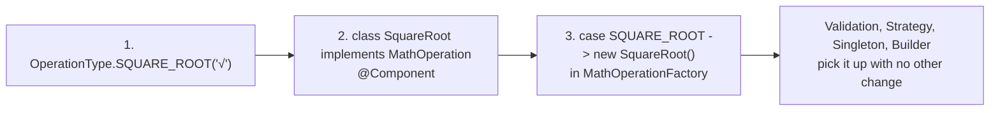

### Open/Closed: adding a new pattern

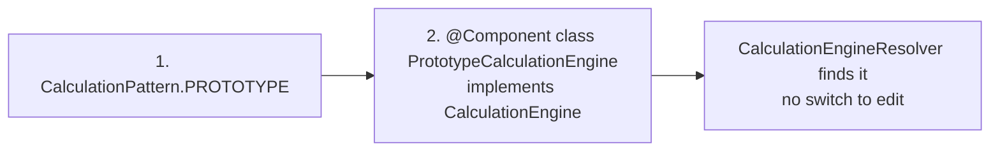

---

## 7. Endpoints

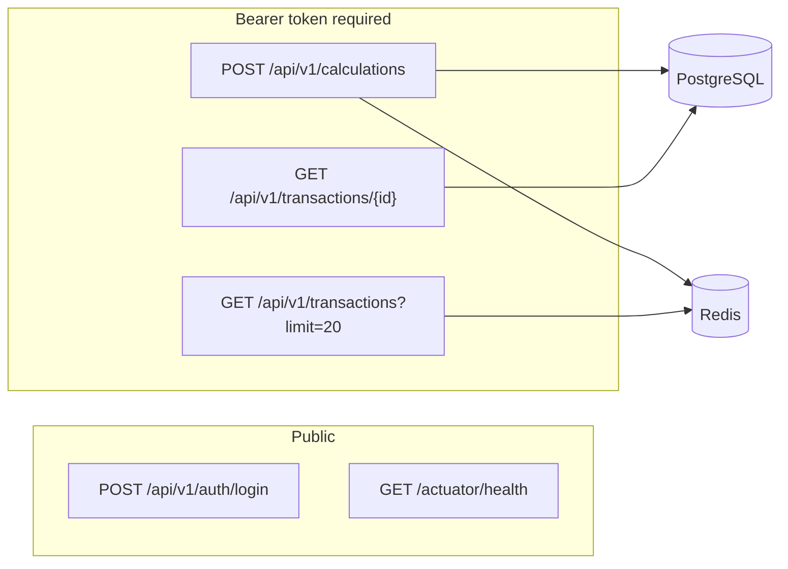

| Method | Endpoint | Auth | Source | Success |
|---|---|---|---|---|
| `POST` | `/api/v1/auth/login` | — | in-memory user | `200` |
| `POST` | `/api/v1/calculations` | Bearer | engine → PostgreSQL + Redis | `201` |
| `GET` | `/api/v1/transactions?limit=1..100` | Bearer | Redis | `200` |
| `GET` | `/api/v1/transactions/{id}` | Bearer | PostgreSQL | `200` |
| `GET` | `/actuator/health` | — | Spring Actuator | `200` |

### Payload

```json
{
  "num1": 10,
  "num2": 5,
  "operation": "+",
  "pattern": "STRATEGY"
}
```

| Field | Rules |
|---|---|
| `num1`, `num2` | required, up to 30 integer digits and 10 decimals |
| `operation` | `+` `-` `*` `/` `%` `^` |
| `pattern` | `SINGLETON` `FACTORY` `STRATEGY` `BUILDER` (any case) |

---

## 8. Response wrapper and errors

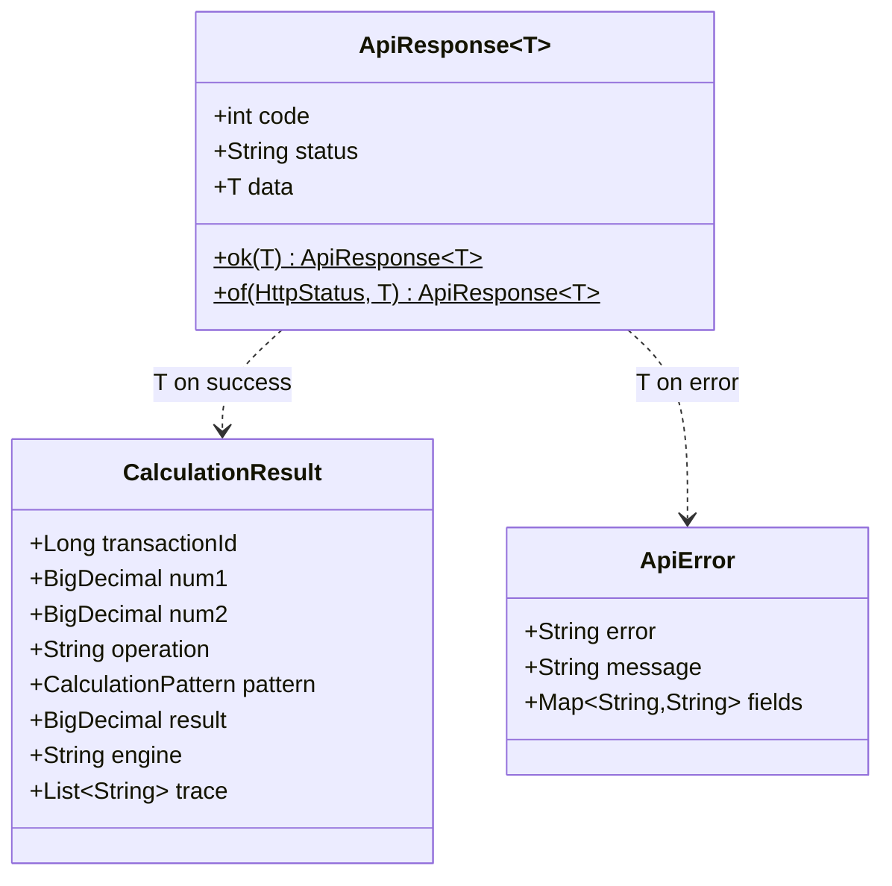

```json
{
  "code": 201,
  "status": "CREATED",
  "data": {
    "transactionId": 1,
    "num1": 10,
    "num2": 5,
    "operation": "+",
    "pattern": "STRATEGY",
    "result": 15,
    "engine": "StrategyCalculationEngine",
    "trace": [
      "OperationStrategyContext selected the Spring bean Addition for '+'",
      "Strategy Addition applied = 15"
    ]
  }
}
```

```json
{
  "code": 400,
  "status": "BAD_REQUEST",
  "data": {
    "error": "Bad Request",
    "message": "Validation failed",
    "fields": {
      "num1": "num1 is required",
      "operation": "operation must be one of + - * / % ^",
      "pattern": "pattern must be one of SINGLETON, FACTORY, STRATEGY, BUILDER"
    }
  }
}
```

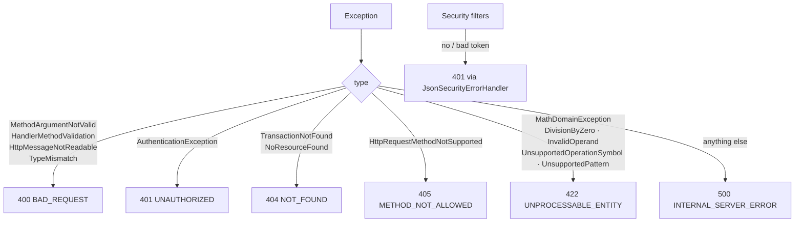

---

## 9. Security (JWT)

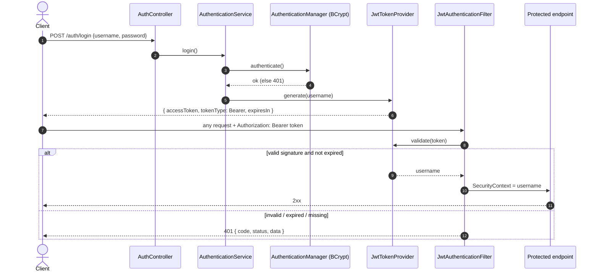

| Variable | Default |
|---|---|
| `JWT_SECRET` | `mistermath-local-secret-change-me-at-least-32-bytes` |
| `JWT_EXPIRATION_SECONDS` | `3600` |
| `APP_USERNAME` | `admin` |
| `APP_PASSWORD` | `admin123` |

---

## 10. Persistence: PostgreSQL + Redis

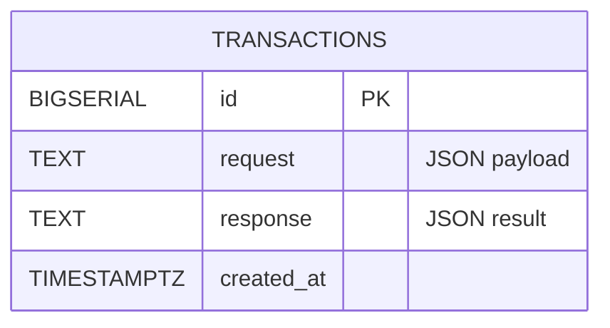

```mermaid
flowchart LR
    H[CalculateCommandHandler] -->|1. INSERT| PG[(PostgreSQL<br/>source of truth)]
    PG -->|id| H
    H -->|"2. LPUSH mistermath:transactions<br/>3. LTRIM 0 99"| RD[(Redis<br/>last 100)]
    RD -. write fails .-> W[WARN log, request still succeeds]
    Q1["GET /transactions"] -->|LRANGE 0 limit-1| RD
    Q2["GET /transactions/{id}"] -->|SELECT by id| PG
```

---

## 11. Logging

```mermaid
flowchart LR
    C[Controller] -->|ApiResponse| RBA[LoggingResponseAdvice<br/>ResponseBodyAdvice]
    GEH[GlobalExceptionHandler] -->|ApiResponse with ApiError| RBA
    RBA -->|INFO success / WARN error| LOG[(log)]
    RBA --> J[JSON to client]
    SEC[JsonSecurityErrorHandler<br/>401 / 403] -->|WARN| LOG
```

```text
INFO  method=POST endpoint=/api/v1/calculations code=201 status=CREATED result=CalculationResult[transactionId=1, num1=10, num2=5, operation=+, pattern=STRATEGY, result=15, ...]
WARN  method=POST endpoint=/api/v1/calculations code=422 status=UNPROCESSABLE_ENTITY error=ApiError[error=Unprocessable Entity, message=Division by zero is not allowed, fields={}]
WARN  method=GET endpoint=/api/v1/transactions code=401 status=UNAUTHORIZED error=ApiError[error=Unauthorized, message=A valid Bearer token is required, fields={}]
```

---

## 12. Docker

```mermaid
flowchart LR
    subgraph compose["docker compose"]
        APP["app<br/>:8080"]
        PG[("postgres:16-alpine<br/>:5432")]
        RD[("redis:7-alpine<br/>:6379")]
        VOL[/postgres-data volume/]
    end
    APP -->|DB_URL| PG
    APP -->|REDIS_HOST| RD
    PG --- VOL
    PG -. healthy .-> APP
    RD -. healthy .-> APP
```

```mermaid
flowchart LR
    A["maven:3.9-temurin-21<br/>mvn package"] -->|mistermath.jar| B["eclipse-temurin:21-jre-alpine<br/>non-root user"]
```

```bash
docker compose up --build        # everything
docker compose up postgres redis # only infra, run the app from the IDE
docker compose down -v           # stop and wipe data
```

---

## 13. CI/CD

```mermaid
flowchart LR
    PUSH([push / pull request to main]) --> CI
    subgraph CI["build-and-test"]
        A[checkout] --> B[JDK 21] --> C["mvn verify<br/>JUnit + Testcontainers + JaCoCo"] --> D[upload reports]
    end
    CI -->|push to main only| CD
    subgraph CD["docker"]
        E[login ghcr.io] --> F[metadata: latest + sha] --> G[build and push image]
    end
    G --> REG[(ghcr.io/jeysson123/mistermath)]
```

```bash
docker pull ghcr.io/jeysson123/mistermath:latest
```

---

## 14. Tests

```mermaid
pie title 109 JUnit 5 tests
    "Operations" : 19
    "Liskov (engines x operations)" : 28
    "Factory / Singleton / Strategy / Builder / Resolver" : 25
    "CQRS handlers" : 6
    "Controllers + advices (MockMvc)" : 13
    "JWT + filter" : 8
    "JPA + Redis adapters" : 6
    "Integration: full context + Testcontainers" : 4
```

```bash
mvn verify                         # tests + coverage (integration test needs Docker, skipped without it)
open target/site/jacoco/index.html # coverage report
```

---

## 15. Project structure

```text
src/main/java/com/math
├── MisterMathApplication.java
├── api
│   ├── advice          GlobalExceptionHandler, LoggingResponseAdvice
│   ├── controller      AuthController, CalculationController, TransactionController
│   ├── dto             ApiResponse<T>, ApiError, CalculationRequest, LoginRequest, TokenResponse
│   └── validation      @SupportedOperation, @SupportedPattern
├── application
│   ├── cqrs            Command, Query, CommandHandler, QueryHandler
│   ├── command         CalculateCommand, CalculateCommandHandler, CalculationResult
│   ├── query           Get...Query, Get...QueryHandler, TransactionView, TransactionViewMapper
│   ├── model           TransactionRecord
│   └── port            TransactionWriter/Reader, TransactionCacheWriter/Reader
├── domain
│   ├── exception       MathDomainException and friends
│   ├── operation       MathOperation, OperationType, Addition ... Power
│   └── pattern         CalculationPattern, CalculationEngine, CalculationEngineResolver
│       ├── singleton   SingletonCalculator, SingletonCalculationEngine
│       ├── factory     MathOperationFactory, FactoryCalculationEngine
│       ├── strategy    OperationStrategyContext, StrategyCalculationEngine
│       └── builder     Expression, BuilderCalculationEngine
└── infrastructure
    ├── cache           RedisTransactionCache, CacheProperties
    ├── persistence     TransactionEntity, TransactionJpaRepository, JpaTransactionStore
    └── security        SecurityConfig, JwtTokenProvider, JwtAuthenticationFilter, ...
```

| Tool | Used for |
|---|---|
| **Lombok** | `@RequiredArgsConstructor` (DI), `@Builder`, `@Data`, `@Getter`, `@Slf4j` |
| **Javadoc** | every class, in Spanish, with ASCII diagrams — `mvn javadoc:javadoc` |
| **Jakarta Validation** | `@NotNull`, `@NotBlank`, `@Digits`, `@Min`, `@Max`, `@Positive`, custom constraints |
